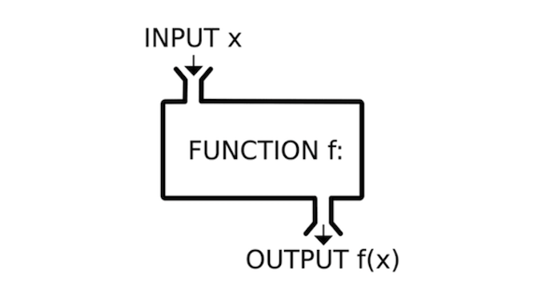
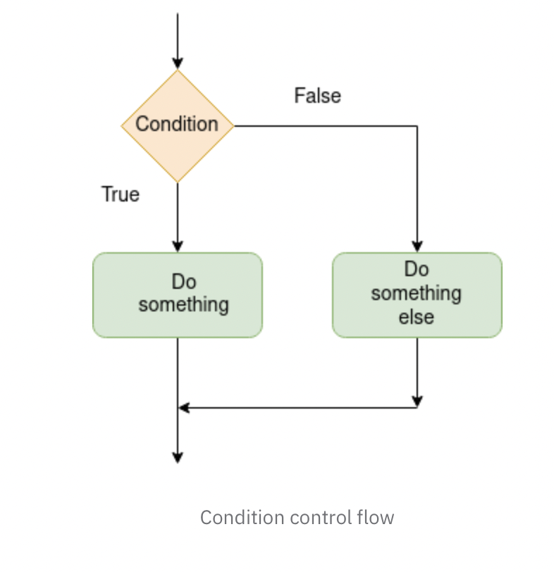

name: toc

```{r setup, include=FALSE}
options(htmltools.dir.version = FALSE)
library(knitr)
opts_chunk$set(
  fig.align="center", 
  fig.height=4, #fig.width=6, 
  # out.width="748px", #out.length="520.75px",
  dpi=300, #fig.path='Figs/',
  cache=F#, echo=F, warning=F, message=F
  )
library(fontawesome)
library(microbenchmark)
library(data.table)
library(ggplot2)
set.seed(123)

```

# Table of contents

1. [Introduction](#intro)

2. [Basic Functions](#basicfunctions)

3. [If Statement](#if)

4. [Advanced Function Features](#advanced)

5. [Functions which Generate Randomness](#rand)

`r fa('star-of-life')` Slides adapted from Drew Van Kuiken and Alex Marsh's ECON 370 and originally based on materials by Grant McDermott's EC 607 at University of Oregon.

---
class: inverse, center, middle
name: intro

# Introduction

<html><div style='float:left'></div><hr color='#EB811B' size=1px width=796px></html>

---
# Agenda

Today we will finally officially cover functions.

While we have already used and talked about them quite a lot, there are a few quirks that we should go over along with learning how to write our own.

---
class: inverse, center, middle
name: basicfunctions

# Basic Functions

<html><div style='float:left'></div><hr color='#EB811B' size=1px width=796px></html>

---
# What is a function? Just like in math!




Terminology
- Function: $f$
- Function input/arguments: $x$
- Function output: $f(x)$

---
# Motivation

Let's generate a simple data.frame: 

```{r}
# Create a data.frame with three variables
# x is from uniform distribution, y is from normal distribution and z is from chi squared distribution
d = data.frame(x=runif(6),y=rnorm(6),z=rchisq(6,1))

# head(d)
```

Imagine we want to rescale each of these vectors so the minimum value in the column is 0 and the maximum in the column is 1. Here is one way we could do this: 

```{r}
# Now, let's try to scale each variable according to x = (x-min(x))/(max(x)-min(x))
d$x = (d$x - min(d$x,na.rm=TRUE))/(max(d$x, na.rm=TRUE) - min(d$x, na.rm=TRUE))
d$y = (d$y - min(d$x,na.rm=TRUE))/(max(d$y, na.rm=TRUE) - min(d$y, na.rm=TRUE))
d$z = (d$z - min(d$z,na.rm=TRUE))/(max(d$z, na.rm=TRUE) - min(d$z, na.rm=TRUE))
```

--

Something's wrong here. 

---
# Motivation 

Look more closely: 
```{r}
d$y = (d$y - min(d$x,na.rm=TRUE))/(max(d$y, na.rm=TRUE) - min(d$y, na.rm=TRUE))
```

I accidentally included the minimum from column x as opposed to column y. In essence, what we want is this: 

```{r eval=FALSE, echo=TRUE}
d$Var = (d$Var - min(d$Var,na.rm=TRUE))/(max(d$Var, na.rm=TRUE) - min(d$Var, na.rm=TRUE))
```

where we can give R a list of columns and it performs the same process on each of them. This is what a function does. Our initial ones will be a little bit simpler though.

---
# What is a function

Functions in programming are just like functions in math: they take in inputs and return a unique output.

Functions allow you to put code that you use frequently into a single line.

> You should consider writing a function whenever you’ve copied and pasted a block of code more than twice (i.e. you now have three copies of the same code).

--

</br> 

*R for Data Science*

Using functions appropriately makes for much cleaner code and code with fewer errors. 

Functions are verbs; arguments are nouns.

Like "**Pick up** *your phone*!" vs. "**Pick up** *this pen*!"

Writing function is basically teaching computer what **Pick up** means.

---
# A Trivial Function

```{r}
# Check whether the name is taken
# ?return_input

return_input = function(x){
  x #return the input as output
}

return_input(1)
# return_input(letters)

return_input = function(x){
  return(x) #this is equivalent AND preferred
}

return_input(1)
```

For this class, `return` is **required** for all self-defined functions, except two cases we will discuss at the end of this lecture. 

---
# Pythagorean Theorem

```{r, echo=FALSE}
# Create a figure to illustrate
# Coordinates for the right triangle
A <- c(0, 0)  # origin
B <- c(4, 0)  # base length b
C <- c(0, 3)  # height length a

# Create data points
triangle <- data.frame(
  x = c(A[1], B[1], C[1], A[1]),
  y = c(A[2], B[2], C[2], A[2])
)

# Midpoints for labels
mid_ac <- data.frame(x = mean(c(A[1], C[1])), y = mean(c(A[2], C[2])), label = "a")
mid_ab <- data.frame(x = mean(c(A[1], B[1])), y = mean(c(A[2], B[2])), label = "b")
mid_bc <- data.frame(x = mean(c(B[1], C[1])), y = mean(c(B[2], C[2])), label = "c")


ggplot() +
  geom_polygon(data = triangle, aes(x = x, y = y), fill = NA, color = "black", linewidth = 1.2) +
  geom_text(data = mid_ac, aes(x = x - 0.2, y = y, label = label), size = 6) +
  geom_text(data = mid_ab, aes(x = x, y = y - 0.2, label = label), size = 6) +
  geom_text(data = mid_bc, aes(x = x + 0.2, y = y + 0.2, label = label), size = 6) +
  coord_equal() +
  theme_void()

```

where a is height, b is base and c is hypotenuse. We have:

$$a^2 + b^2 = c^2$$


---
# Pythagorean Theorem

Let's build a function to calculate the hypotenuse given the base and height. As always, start by checking for any potential name conflicts!

```{r}
# Precautionary step to make sure we are not creating conflicting names
# ?Hypotenuse

# Function to calculate Hypotenuse with a and b given
Hypotenuse = function(a,b){
  return(sqrt(a^2+b^2))
}
Hypotenuse(3,4)
# Hypotenuse(1:5,2:6)
# Hypotenuse(3,1:5)
# Hypotenuse(3:5,1:5) #don't do this
```

---
# A Weighted Mean

Now, let's create the weighted average function. This is how your final grade is calculated!

```{r,error=TRUE}
# Create the weighted average function: x is the value, w is the weight
wt_mean = function(x,w){
  return(sum(x*w)/sum(w))
}
wts = runif(20)
wt_mean(1:20,wts)
```

--

```{r}
# If you change the order of argument, you must tell computer what they are
wt_mean(wts, 1:20)
wt_mean(w = wts, x=1:20)
```

**Be careful here!**

---
# Weighted Mean for Simple Mean

What if I also want to use this function for simple average?

--

```{r}
# Use weighted mean for simple mean
wt_mean(1:20, rep(1, length(1:20)))

# Check whether the result are the same
mean(1:20) == wt_mean(1:20, rep(1, length(1:20)))
```

`rep(1, length(1:20))` is kind of too much to write. Can we make it simpler?

---
# Default Arguments 

In `R` you can define default arguments for functions. Typically you do this if there's a value that is used often and you don't want to always pass it to the function.

We've already seen one example of default arguments:

```{r, eval=FALSE}
# Below two lines are the same
rnorm(1)
rnorm(1,mean=0,sd=1)
```

To define a default argument, simply add it to the list of arguments with an equal sign and the default value.

```{r}
# Simple addition but have y with default value 2
test_fun = function(x, y=2){
  return(x+y)
}
test_fun(3)
```

---
# Default in Default

We can also have functions (with default argument) in default.

```{r}
# ? normalize
# normalize data by subtracting mean and divide by standard deviation
normalize = function(x, m = mean(x),s = sd(x)){
  return((x - m)/s)
}
normalize(c(1:10,NA))
```
--
```{r}
# want to make mean and standard deviation dealing with NA
normalize = function(x, m = mean(x,na.rm=na.rm),s = sd(x,na.rm=na.rm),na.rm=FALSE){
  return((x - m)/s)
}
normalize(c(1:10,NA))
normalize(c(1:10,NA),na.rm=TRUE)
```


---
# Default Arguments: Weighted Mean

I want to calculate the simple average if weight is not specified.

--

```{r}
# Add the default argument for the weights
wt_mean = function(x,w=rep(1,length(x))){
  # Description: Takes the weighted average of x using weights w
  # Default w is a vector of 1s the same length as x.
  sum(x*w)/sum(w)
}

# Check whether the result are the same
wt_mean(1:20) == mean(1:20)
```

---
# Problems with Weighted Mean

`x` and `w` should have the same length! Try the code below:

```{r,error=TRUE}
# Try different length of x and w
wt_mean(1:20,wts[-1])
wt_mean(1:20,c(0.1,0.2,0.3,0.3))
```

What happened? How should we deal with this?

---
class: inverse, center, middle
name: if

# If Statement

<html><div style='float:left'></div><hr color='#EB811B' size=1px width=796px></html>

---
# Intro to Control Flow

Control flow refers to ways in which we control the order in which code is executed.

We can use logical gates to control the path our code takes.

Note: for simplicity, taking if statements outside of function definitions over the next couple slides.

```{r, echo=FALSE, out.width="50%", fig.cap="A nice image."}

```

---
# if Statements

If statements are the most fundamental aspect of control flow.

If something is true, then the code is executed. Otherwise, the code moves on.

If statements must take a logical as an input: either `TRUE` or `FALSE`.

```{r}
x = 2
# Print only if x is negative
if(x < 0){
  print("x is less than 0")
}
```

Notice nothing printed!

--

```{r}
x = -1
# Print only if x is negative
if(x < 0){
  print("x is less than 0")
}
```

---
# if, else if, and else

However, sometimes we want to check multiple conditions. We can use else if and else statements.

```{r}
# Generate a random x (from uniform distribution)
x = runif(1,-1,1)
x
# Print different message for x with different signs
if(x > 0){
  print("x is positive!")
} else if(x < 0){
  print("x is negative!")
} else{
  print("x is 0!")
}
```
---
# More on if Statments

Let me show you an example of bad code
```{r}
# Generate grade around 85
grade = 85 + rnorm(1,sd=5)
# Use if condition to find corresponding letter grade
if (grade >= 90) {
  cat("A",round(grade),"is an A")
} 
if (grade >= 80 & grade < 90) {
  cat("An",round(grade),"is a B")
} 
if (grade >= 70 & grade < 80) {
  cat("A ",round(grade),"is a C")
} 
if (grade >= 60 & grade < 70) {
  cat("A",round(grade),"is a D")
} 
if(grade < 50){
  cat("A",round(grade),"is an F")
}
```

Note: `cat` is almost the same as `print(paste(...))`.

---
# More on if Statments

To write clean code, we usually put same set of conditions together. There are also less to write in the statement:

```{r}
# Put all if else conditions together
if (grade >= 90) {
  cat("A",round(grade),"is an A")
} else if (grade >= 80) {
  cat("A",round(grade),"is a B")
} else if (grade >= 70) {
  cat("A",round(grade),"is a C")
} else if (grade >= 60) {
  cat("A",round(grade),"is a D")
} else{
  cat("A",round(grade),"is an F")
}
```

---
# More on if Statments

This would not run, why?

```{r, error = T}
# Problem code
statement = F
if(statement)
{print("It's True!")
}
else
{print("It's False!")}
```

--

The `else if` and `else` statements must be on the same line as the curly bracket:

```{r, error = T}
statement = F
# Condition statements
if(statement)
{print("It's True!")
} else
{print("It's False!")}
```
---
# More on if Statments

If everything fits on one line, that then don't need curly brackets.

```{r}
# One line if else
x1 = if(TRUE) 2 else 3
x2 = if(FALSE) 2 else 3
c(x1,x2)
```

---
# Vectorized if Statments

With the standard if statement, R only allows a single logical value to be supplied. 

```{r,error=T}
vals = c(F,T)
# Check how R deal with vectors in if
if(vals){
  print("TRUE!")
}
```

--

</br>

To do if else operations with a vector of logicals, use `ifelse()`

```{r}
x = 1:10
# Return even/odd for corresponding numbers
ifelse(x %% 2 == 0, "Even","Odd")
```
---
# Test Your Understanding

Take 30 seconds to think about the following, then group up with the person next to you and discuss: 

Using `ifelse()` commands, write a block of code that prints out "the remainder is r" for the integers 1 to 10 where r is the remainder when dividing by 3. For remainder 0, print "divisible".

--

What about a vector from 1 to 100, only prints "value is x" when divisible by 10?

---
# Conditions

Sometimes we would like to throw an error, warning, or message while controlling the flow of the code.

This can be done with the following respective functions: `stop()`, `warning()`, `message()`.

```{r,error=T}
x = 0
if(x>0){
  print(1/x)
}else if(x<0){
  print(-1/x)
}else{stop("You cannot divide by 0!")}

warning("This is a warning!")
message("This is a message!")
```

---
# Conditions

- Errors stop code from running. These should be used to prevent something very bad from running.
- Warnings will still allow for code to run, but in most cases, caution should be taken when the warning is triggered.
- Messages can be useful when writing functions to see what is happening inside of it.

```{r, error=TRUE}
# Example of stop stopping all code below
stop("I will stop all code below!")
# print("Not Stopped!")
```

--

</br>

Why not just use `print` or `cat`?

--

`print` or `cat` cannot be turned off! More in lecture5.


---
# Weighted Mean: with Error Message

Now, we can use if statement to stop the weighted mean function when `x` and `w` have different length!

--

```{r}
# Weighted mean but x and w must have same length
wt_mean = function(x,w=rep(1,length(x))){
  # Use conditional statement to error out
  if(length(x)!=length(w)){
    stop("x and w must be the same length")
  }
  sum(x*w)/sum(w)
}
```


---
class: inverse, center, middle
name: advanced

# Advanced Function Features

<html><div style='float:left'></div><hr color='#EB811B' size=1px width=796px></html>

---
# Writing Functions: Good Style

The following are some recommendations for good programming style with functions:

1. Name your functions something descriptive.
 - Remember, they are verbs!
2. Always check whether the function names are taken by `?`.
3. Try to foresee errors and incorrect inputs to your functions and program in errors and warnings.
 - This is less important if your functions are only for you. 
4. Always be clear about what function returns by `return`.
5. Comment, comment comment!
6. If you write a "family" of functions, try to use similar naming schemes.
7. Scope....

---
# Scope

I've referred to the **global environment** a lot throughout lectures. In terms of scope, it is the most general. 

--

However, the environment within a function is a separate, more specific environment. Understanding this difference is important.

--

- Variables in the global environment can be referred to in `R`. However, it is generally frowned upon to refer to too many global variables within functions
  - It also depends on how lazy you're being

--

- Variables in a function environment that are not returned ***will not*** be saved in the global environment. 
  - *What happens in a function, stays in a function.*
 
--
 
Let's see some examples.

---
# Scope Examples

```{r,error=T}
# Global variables work in functions
y = 2
add_xy = function(x){
  return(x + y)
}
add_xy(3)
```

--

```{r,error=T}
# Variables in functions not work in Global
my_mean = function(x){
  x_sum = sum(x)
  return(x_sum/length(x))
}
my_mean(1:10)
x_sum
```

---
# Advice Regarding Scope

- Variables that are **unlikely to change** throughout a script are safe to be created and referred to as "global variables."
 - e.g. the cleaned dataset that can be used for different analysis.
 
- When writing functions, only refer to variables in the global environment that meet the requirements described above. Relying on globals too much is sloppy programming.

- However, writing functions with too many arguments is also bad programming. You have to find a balance.

- There are ways to save variables created in a function to the global environment (look up <<-). I would generally avoid these. They can get you into trouble.

---
# Returning vs Printing

I have hinted at the difference between `return` an object and `print` an object before. 

This distinction matters the most for functions.

- When you **return** an object from a function, that is the only thing that can be returned.

- When you **print** an object, it shows output but does not return the object from the function unless you also specify it to print.

</br>

The best thing I can say to understand the difference is that **printing** is for **you** and **returning** is for the **computer**!

Let's look at some examples.

---
# Returning vs Printing

Print what we want to print and then return what we want to return.

```{r}
plus_delta = function(x,delta=1){
  # Show what we are doing
  print(paste0("We are adding ", delta, " to ", x, "!"))
  # Return the numerical value
  return(x + delta)
}

plus_delta(5)
plus_delta(4.5,0.75)
```
---
# Returning vs Printing

Nothing will work after `return`! `return` should be at the last line.

```{r}
plus_delta = function(x,delta=1){
  # Return the numerical value
  return(x + delta)
  # Show what we are doing
  print(paste0("We are adding ", delta, " to ", x, "!"))
}

plus_delta(5)
plus_delta(4.5,0.75)
```

---
# Returning vs Printing

```{r}
plus_delta = function(x,delta=1){
  # calculate the numerical value
  x + delta
  # Show what we are doing
  print(paste0("We are adding ", delta, " to ", x, "!"))
}

# run the function plus to 1
x = plus_delta(1)
x
```

What happened?

--

If there is no return and the last line prints an object, will also return the printed *object* (not the printed characters). **NOT RECOMMENDED!**

Have a `return` if you want to return something.

---
# Misc Aspects of Functions

Functions don't have to have arguments.

Functions don't have to return an object.

Functions can only return one object; however, if you're using if statements, there might be multiple returns specified. It's just ultimately only one will be used.

If you want to return multiple objects, make a list!!

You can write functions to take an arbitrary number of inputs using `...` notation.

---
# No arguments and No return

**Print Function**: If just need a function to print something, then no need for input/return.
```{r}
# Printing function, no input or output
say_hello = function(){
  cat("Hello! :)")
} #notice, nothing is being returned either!!

say_hello()
```

--

**Update Function**: If just need a function to update global variables (with `<<-`), then no need for input/return as well. (Not recommended, but can be useful.)
```{r}
x = 0
# Updating function, no input or output
Add1_to_x = function(){
  x <<- x+1
} #notice, nothing is being returned either!!

Add1_to_x()
x
```

---
# print vs. cat

We talked about `print` and `cat` are slightly different.
- `cat` only prints input, but there is no output of `cat` function!
  - It also does not start a new line at the end unless you put in '\n'
- `print` prints the input, but also have the input as output!
  - `print` always start a new line at the end.

```{r}
# Using cat to print but nothing is returned as output
x = cat("Hello cat!")
```

```{r}
# Using print to print and the input itself is returned as output
x = print("Hello print!")
```


---
# Conditional Returns

Tax rate usually is different for different income level! Let's try this example:

1. 10% below 10k
2. 20% between 10k and 40k
3. 30% above 40k

--

```{r}
# Define a function to calculate tax based on income
tax_bracket = function(income) {
  if (income <= 10000) {
    return(0.1 * income) # 10% below 10k
  } else if (income <= 40000) {
    return(0.1 * 10000 + 0.2 * (income - 10000)) # 20% between 10k and 40k
  } else {
    return(0.1 * 10000 + 0.2 * 30000 + 0.3 * (income - 40000)) # 30% above 40k
  }
}

# Test the tax_bracket function
tax_bracket(8000)
# tax_bracket(25000)
# tax_bracket(60000)
```

---
# Multiple Returns

For the tax calculator function, I also want the `effective tax rate = tax paid/income`.

```{r}
# Define a function to calculate tax based on income, also effective tax rate
tax_bracket <- function(income) {
  if (income <= 10000) {
    amount = 0.1 * income # 10% below 10k
  } else if (income <= 40000) {
    amount = 0.1 * 10000 + 0.2 * (income - 10000) # 20% between 10k and 40k
  } else {
    amount = 0.1 * 10000 + 0.2 * 30000 + 0.3 * (income - 40000) # 30% above 40k
  }
  return(list(amount = amount, effective_rate = amount/income)) 
}

# Test the tax_bracket function
tax_bracket(8000)
# tax_bracket(25000)
# tax_bracket(60000)
```

---
# Arbitrary Inputs

```{r}
commas = function(...){
  out = paste(...,sep = ", ")
  out
}

commas("red","blue", "yellow","green")

```

Any arguments that come after `...` *must have default arguments!*

---
class: inverse, center, middle
name: rand

# Functions which Generate Randomness

<html><div style='float:left'></div><hr color='#EB811B' size=1px width=796px></html>

---
# Draw from Vector

We can use `sample` function to draw from a vector. With replacement or  without replacement.

This is like drawing a card from a deck. You can put it back before drawing the second card or do not put it back.

```{r}
# Use sample() to draw from a vector
# Draw 10 letters with replacement
sample(letters, 10, replace = T)

# Draw 10 numbers from 1 to 10 with replacement
sample(1:10, 10, replace = T)

# Draw 10 numbers from 1 to 10 without replacement
sample(1:10, 10, replace = F)
```

---
# More Data Structure Random Draw

We can draw random elements in a vector/matrix/list/data.frame by drawing random index!

```{r}
# Draw 3 rows from cars dataset without replacement
cars[sample(1:nrow(cars), 3, replace = F),]
```

---
# Draw from Continuous Distribution

Sometimes, we what to have draw from a continum of numbers. There are three useful distributions we have demonstrated with the example at the beginning.

We will come back to this later.

```{r}
# x is from uniform distribution, y is from normal distribution and z is from chi squared distribution
d = data.frame(x=runif(6),y=rnorm(6),z=rchisq(6,1))
```


---
# Reproducibility

Reproducibility is vital! We need to ensure people are not just making things up.

However, if we draw random numbers twice, the result would be different!

```{r}
# Check whether the data are the same without set.seed
d1 = data.frame(x=runif(6),y=rnorm(6),z=rchisq(6,1))
d2 = data.frame(x=runif(6),y=rnorm(6),z=rchisq(6,1))

d1 == d2
```

---
# Set Seed

This is why we set a seed! Using the same seed ensures that anyone, at any time, will get the **same random result**.

Think of R as having a very long, fixed sequence of random numbers. The seed simply tells R **where to start** in that sequence!

```{r}
# Check whether the data are the same with set.seed
set.seed(2025)
d1 = data.frame(x=runif(6),y=rnorm(6),z=rchisq(6,1))
set.seed(2025)
d2 = data.frame(x=runif(6),y=rnorm(6),z=rchisq(6,1))

all.equal(d1, d2)
```


---
class: inverse, center, middle

# Next lecture(s): Loops

<html><div style='float:left'></div><hr color='#EB811B' size=1px width=796px></html>


```{r gen_pdf, include = FALSE, cache = FALSE, eval = TRUE}
infile = list.files(pattern = '.html')
#pagedown::chrome_print(input = infile, timeout = 10000)
#xaringan::decktape(infile, "04-functions.pdf")
```
